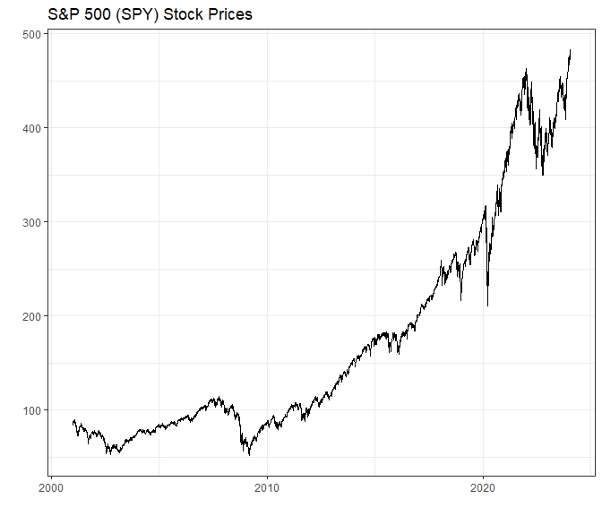
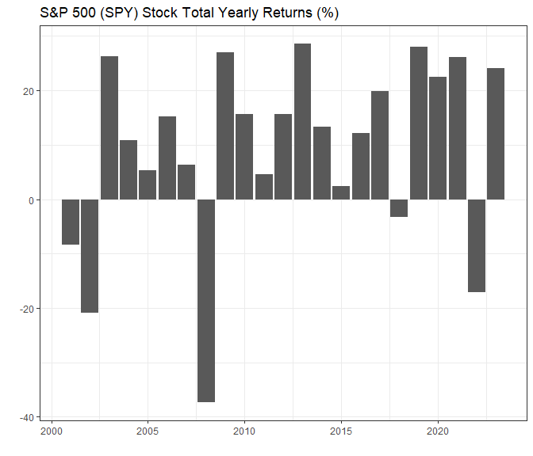

Week 2 Workshop
================
YH
2024-01-24

- [Exercise with data](#exercise-with-data)
  - [Statistics of S&P daily returns](#statistics-of-sp-daily-returns)
  - [Prices of S&P in this period](#prices-of-sp-in-this-period)
  - [Total yearly returns of S&P from 2001 to
    2023](#total-yearly-returns-of-sp-from-2001-to-2023)

# Exercise with data

Download `wk2_stocks.rds` from Canvas. The data contain historical
prices and volume for S&P 500 index (SPY) from the web. Read it into
`R`.

``` r
df <- readRDS("../data/wk2_stocks.rds")
str(df)
```

    ## 'data.frame':    5798 obs. of  4 variables:
    ##  $ SPY_prices : num  88.1 87.1 84.3 84.9 84.7 ...
    ##  $ SPY_returns: num  0.04804 -0.01076 -0.03264 0.00774 -0.00264 ...
    ##  $ SPY_vol    : num  88.1 87.1 84.3 84.9 84.7 ...
    ##  $ date       : Date, format: "2001-01-03" "2001-01-04" ...

## Statistics of S&P daily returns

- The cumulative returns of the S&P index during this period is 218.33%.

- The average daily returns of the S&P index during this period is
  0.04%.

- The standard deviation of the daily returns of the S&P index during
  this period is 1.22%.

## Prices of S&P in this period

``` r
library(tidyverse)
ggplot(data = df, aes(x = date, y = SPY_prices)) +
  geom_line() +
  theme_bw() +
  labs(x = "", y = "", title = "S&P 500 (SPY) Stock Prices")
```

<!-- -->

## Total yearly returns of S&P from 2001 to 2023

``` r
df %>%
  mutate(year = year(date)) %>%
  filter(year <= 2023) %>%
  group_by(year) %>%
  summarize(yr_returns = sum(SPY_returns)*100) %>%
  ggplot(aes(x = year, y = yr_returns)) +
  geom_col() +
  theme_bw() +
  labs(x = "", y = "", title = "S&P 500 (SPY) Stock Total Yearly Returns (%)")
```

<!-- -->
